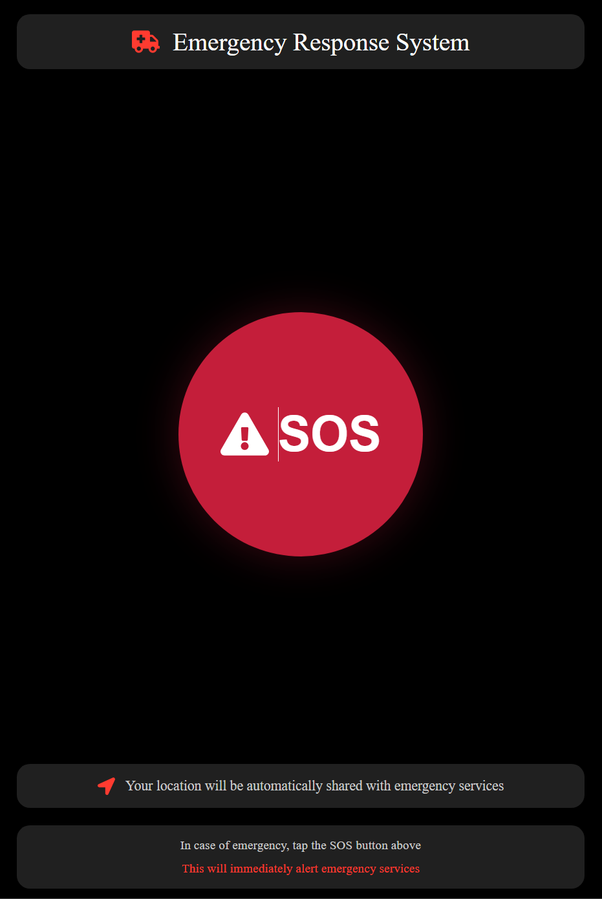
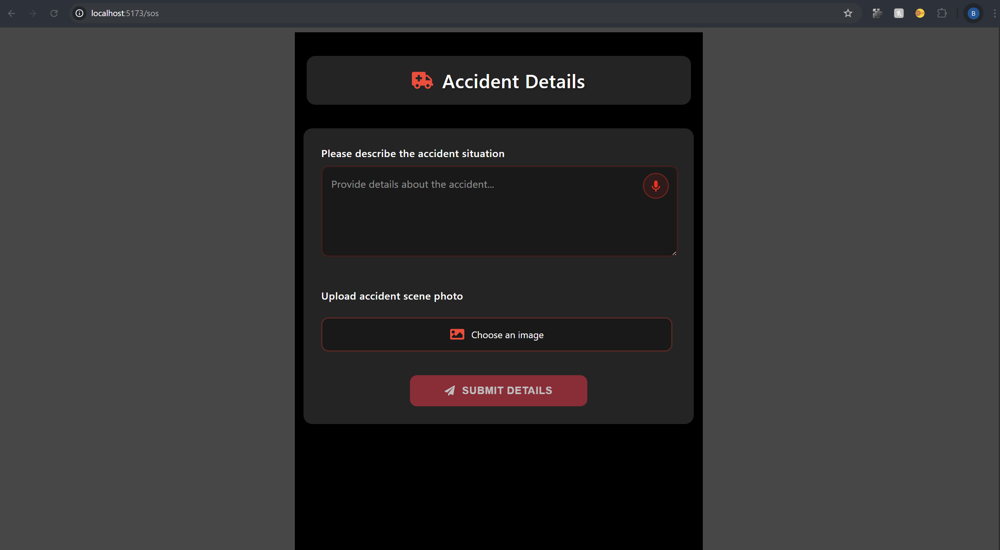
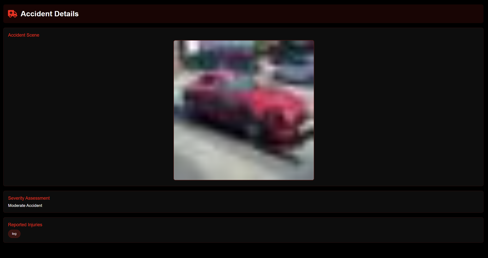

# 🚑 Emergency Response System – React.js + Flask + MongoDB

A full-stack emergency response platform built with **React.js** (frontend), **Flask** (backend), and **MongoDB** (database) that accelerates accident reporting and rescue coordination through real-time SOS alerts and smart accident analysis.

This project enables users to instantly trigger SOS alerts, report accident scenes, and assist emergency responders and ambulance drivers with detailed situational awareness.

---

## 📌 Overview

The Emergency Response System allows users to:
- Tap an SOS button to immediately alert emergency services with live location
- Upload accident scene images and describe incidents
- View severity assessments and reported injuries
- Enable responders and ambulance drivers to access real-time accident data

It provides a responsive, mobile-friendly UI, secure API integrations, and dynamic data handling using a scalable NoSQL backend.

---

## 🛠️ Tech Stack

### 🌐 Frontend
- React.js 18
- React Router
- TailwindCSS
- Vite

### ⚙️ Backend
- Flask (Python)
- RESTful APIs
- Geolocation & Image Upload Handling

### 🗄️ Database
- MongoDB Atlas

### 🔧 Tools
- npm
- pip
- GitHub Pages (optional frontend deployment)

---

## ✨ Features

- **SOS Alert**: Immediate location-based SOS trigger to emergency responders
- **Accident Scene Reporting**: Upload images and provide incident descriptions
- **Responder Dashboard**: View alerts, injury reports, and scene photos
- **Driver Dashboard**: Navigation and emergency details for ambulance drivers
- **Smart Severity Assessment**: Analyze reported injuries and accident severity

---

## 🖼️ Screenshots

### 🚨 SOS Button View


### 📝 Accident Reporting Form


### 🛡️ Emergency Responder Dashboard


---

## 📚 API Endpoints

| Method | Endpoint | Description |
|:------:|:--------:|:-----------:|
| POST | `/api/sos` | Trigger SOS alert with location and details |
| GET | `/api/alerts` | Retrieve active SOS alerts |
| POST | `/api/upload` | Upload accident scene images |
| GET | `/api/alerts/:id` | Fetch detailed accident report |

---

## 🚀 Getting Started

### 1. Clone the Repository
```bash
git clone https://github.com/your-username/sos-emergency-system.git
cd sos-emergency-system
